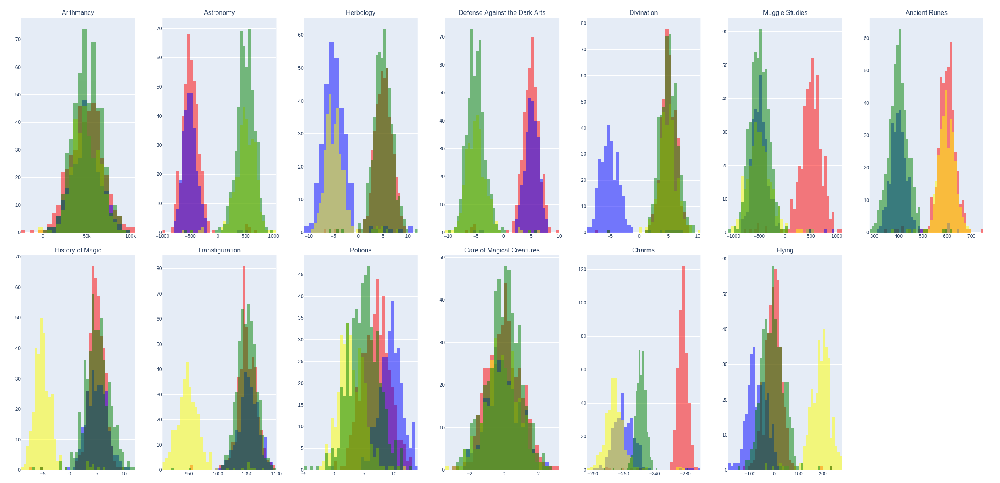
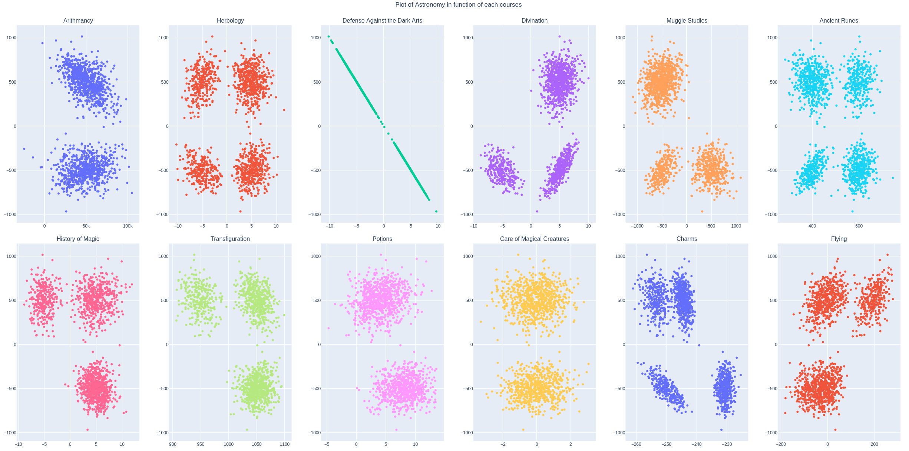

# dslr - School 42 Paris

## Datascience X Logistic Regression  

In this project I had to implement a linear classification model.
The two main focus points are :
- learn how to read a data set, to visualize it in different ways, to select and clean unnecessary information from a data set
- train a logistic regression that will solve classification problem

## Data visualization

### Histogram : 

We can clearly see that arithmancy and care of magical creature courses have a homogeneous score distribution between all four houses. So there will not be good features for our classification.

### Scatter plot :

It's easy to say that the astronomy and defense against the Dark Arts courses are very similar. So no need to include both in our regression.

### Pair plot :

