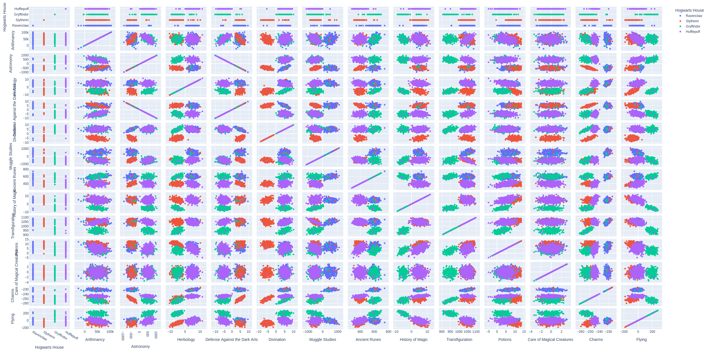
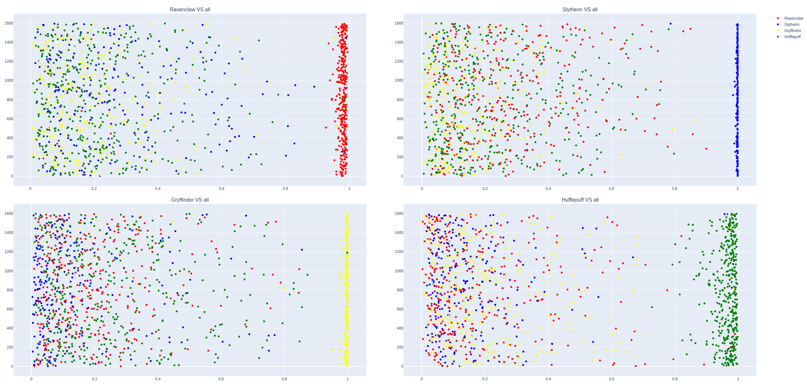

# dslr - School 42 Paris

## Datascience X Logistic Regression  

In this project, I had to implement a linear classification model.
The two main focus points are :
- learn how to read a data set, to visualize it in different ways, to select and clean unnecessary information
- train a logistic regression that will solve a classification problem

## Data visualization :

### Histogram : 


We can see that arithmancy and care of magical creature courses have a homogeneous score distribution between all four houses. So there aren't good candidates for our classification.

### Scatter plot :


It's easy to say that the astronomy and defense against the Dark Arts courses are very similar. There is no need to include both in our regression.


### Pair plot :


From this pair plot, we can choose the features that are the more relevant :
- Divination to be able to separate Slytherin from the other houses
- Transfiguration for Gryffindor
- Astronomy to choose between Hufflepuff and Ravenclaw

## Logistic regression :

### Theory :

Logistic regression is a statistical model that uses a logistic function to model a binary dependent variable. The concept is similar to the linear regression, we will iterate "epoch" number of times to reduce θ. Except, this time, the cost function will act differently :
- If our correct answer 'y' is 0, then the cost function will be 0 if our hypothesis function also outputs 0. If our hypothesis approaches 1, then the cost function will approach infinity.
- If our correct answer 'y' is 1, then the cost function will be 0 if our hypothesis function outputs 1. If our hypothesis approaches 0, then the cost function will approach infinity.

Like this, we will be able to "punish" hardly the algorithm when the result is wrong.

The cost function is :
$$J(θ) =−\frac1m \sum_{i=1}^m y^ilog(h_θ(x^i)) + (1−y^i) log(1−h_θ(x^i))$$
And the vectorized form is :
$$h=g(Xθ)$$
$$J(θ)= \frac1m⋅−y^Tlog⁡(h)−(1−y)^Tlog⁡(1−h)$$
Finally for the hypothesis we will have the Sigmoid function :
$$g(x) = \frac{1}{1+e^{-x}}$$

The model is binary, 0 or 1. The classification chosen is "One-vs-all" it is a multiclass classification where we are basically choosing one class and then lumping all the others into a single second class.

### Application :

When the theory is implemented we have a complete classifier for this problem that is capable of giving the probability of a new student to be in each house between 0 and 1. We then take the maximun probability and class this student in the corresponding house. 

We can graph the outputs to have a better understanding of the logistic regression :



The accuracy score of the program is 98.23%.

## Usage :

Create virtual environment by running `python3 -m venv venv` then activate it with `source venv/bin/activate`.  

Install all dependencies by running `pip install -r requirements.txt`.  

Then `python logreg_train.py` to train the algorithm and `python logreg_predict.py` for the prediction.

Similarly, all utilities can be used with :
```
python utilities/describe.py
python utilities/histogram.py
python utilities/scatter_plot.py
python utilities/pair_plot.py
```

In [graphs directory](graphs/) there are HTML files that can be opened directly from a browser to see all graphs along with PNG.
